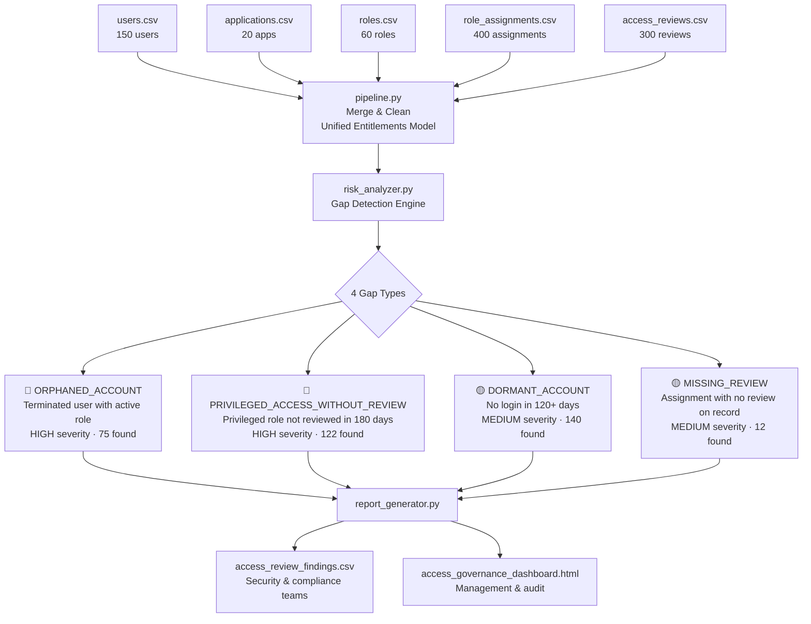

# IAM Access Review Analyzer


> **Enterprise IAM access review pipeline — 150 users · 20 applications · 60 roles · 400 assignments · 349 governance findings across 4 gap types**

---

## Overview

Access reviews are one of the most consistently neglected parts of enterprise IAM. Every organisation has role assignments that were created years ago, never reviewed, attached to users who left or changed roles, or granted at a privilege level that was never re-evaluated. The problem is not that nobody cares. It is that the data is scattered across HR systems, IAM platforms and certification tools with no single view of what is actually happening.

This pipeline builds that view from scratch — ingesting from 5 sources, merging into a unified entitlements model and running automated risk analysis to surface governance gaps that need action.

---

## Results at a Glance

| Metric | Value |
|---|---|
| Users analysed | 150 |
| Applications covered | 20 |
| Role assignments processed | 400 |
| Access reviews ingested | 300 |
| Total governance findings | **349** |
| HIGH severity findings | **197** |
| MEDIUM severity findings | **152** |

---

## Governance Findings

### Findings by Gap Type


### Risk Severity Distribution


### Findings by Department


### Top Applications by Risk Exposure


---

## Architecture



---

## Gap Type Reference

| Gap Type | Trigger Logic | Severity | Typical Action |
|---|---|---|---|
| `ORPHANED_ACCOUNT` | User status = TERMINATED but assignment still ACTIVE | 🔴 HIGH | Immediate deprovisioning |
| `PRIVILEGED_ACCESS_WITHOUT_REVIEW` | Privilege level = PRIVILEGED and no review in 180 days | 🔴 HIGH | Mandatory recertification |
| `DORMANT_ACCOUNT` | Last login more than 120 days ago | 🟡 MEDIUM | Account suspension review |
| `MISSING_REVIEW` | Assignment exists with no review record at all | 🟡 MEDIUM | Schedule certification |

---

## Data Sources

| File | Records | Key Fields |
|---|---|---|
| `users.csv` | 150 | user_id, full_name, department, status (113 active · 37 terminated) |
| `applications.csv` | 20 | SAP Finance, Workday HR, ServiceNow, Salesforce, Splunk + 15 others |
| `roles.csv` | 60 | role_name, privilege_level (READ_ONLY · STANDARD · PRIVILEGED) |
| `role_assignments.csv` | 400 | user-app-role mapping, assigned_date, last_login, assignment_status |
| `access_reviews.csv` | 300 | review_status (108 approved · 98 pending · 94 not reviewed) |

---

## Project Structure

```
iam-access-review-analyzer/
│
├── data/
│   ├── users.csv
│   ├── applications.csv
│   ├── roles.csv
│   ├── role_assignments.csv
│   └── access_reviews.csv
│
├── src/
│   ├── risk_analyzer.py        # Gap detection logic — 4 gap types with severity rules
│   └── report_generator.py     # HTML dashboard generator
│
├── output/
│   ├── access_review_findings.csv
│   └── access_governance_dashboard.html
│
├── docs/                       # Chart images for README
│
├── pipeline.py                 # Main entry point
└── README.md
```

---

## How to Run

```bash
pip install pandas
python pipeline.py
```

Open `output/access_governance_dashboard.html` in your browser to see the full governance dashboard.

---

## Live Dashboard

[View the IAM Access Governance Dashboard →](https://pavan-resume-de.s3.ap-south-1.amazonaws.com/access_governance_dashboard.html)

---

## Relationship to IAM Connection Governance Pipeline

This project and the [IAM Connection Governance Pipeline](https://github.com/pavansri8886/iam-connection-governance-pipeline) address two different layers of the same problem.

```
┌─────────────────────────────────────────────────────────┐
│  IAM Connection Governance Pipeline                     │
│  "Do the right IAM products cover the right apps?"     │
│  → Application layer · Coverage gaps · Remediation SLAs│
└─────────────────────────────────────────────────────────┘
                          +
┌─────────────────────────────────────────────────────────┐
│  IAM Access Review Analyzer  (this repo)                │
│  "For users who have access, is that access valid?"     │
│  → User layer · Entitlement risk · Review coverage      │
└─────────────────────────────────────────────────────────┘
                          =
         Complete enterprise IAM governance picture
```

---

## What I Would Build Next

The logical next layer is **Separation of Duties (SoD) analysis** — detecting toxic role combinations where a single user holds permissions that should never coexist (for example, the ability to both create and approve a payment in SAP Finance). That requires a conflict matrix defined per application, which is a natural extension of the roles and assignments data already in this pipeline.

---

**Pavan Kumar Naganaboina**
MSc Data Management & AI — ECE Paris 2025–2026

[](https://linkedin.com/in/pavankumarn01)
[](https://github.com/pavansri8886)
